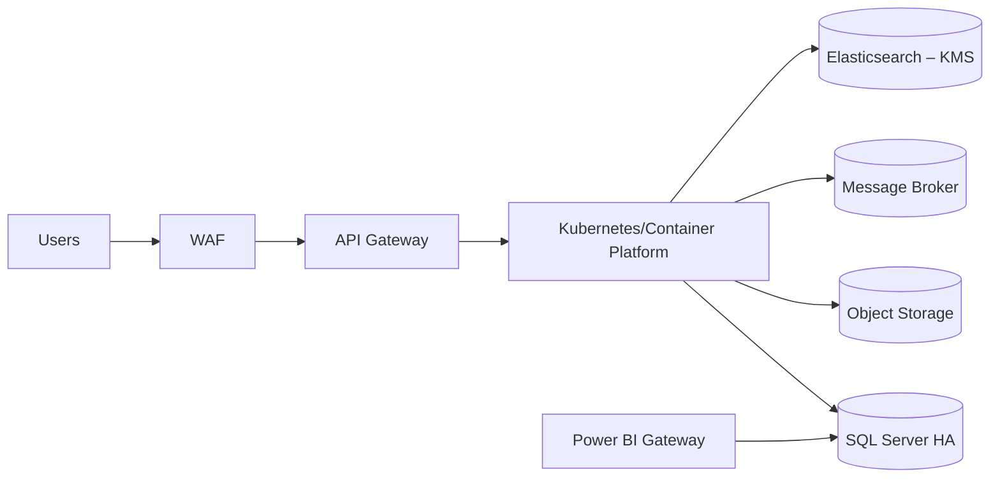

# MNFSR IT System – Deployment & Go-Live Plan

## Document Information
- **Project**: Digital Transformation of MNFSR
- **Client**: Ministry of National Food Security & Research (MNFSR), Pakistan
- **Version**: 1.0
- **Date**: September 2025
- **Prepared By**: SOFT PYRAMID

---

## 1. Executive Summary
This plan describes the deployment approach for the six-module MNFSR system on Government Cloud infrastructure, detailing environments, infrastructure specifications, procedures, database migration, training, go-live, rollback, and post-deployment support.

---

## 2. Environments & Topology
- Environments: Development, Staging (UAT), Production
- Network: Segregated VNETs; private subnets for services/DB; public WAF/gateway only
- DNS & Certs: Government-managed domains; TLS 1.3 certs via approved CA

---

## 3. Infrastructure Requirements & Specifications
- Compute: Container cluster (3+ nodes per env); autoscaling; node pools for workers
- Database: SQL Server HA (Always On/Failover Cluster); backup node; read replica for BI
- Storage: Encrypted object storage with versioning; file scan service
- Networking: WAF, API Gateway, NAT, Bastion; IP allowlists for admin access
- Observability: Centralized logs, metrics, traces; alerting integrations

---

## 4. Deployment Procedures & Checklists
- CI/CD: Build → Test → Security gates → Deploy to Staging → UAT → Production approval → Blue/Green or Rolling
- Pre-deploy checklist:
  - Change request approved; rollback plan verified
  - DB migrations reviewed; backups verified
  - Secrets configured in vault; connections whitelisted
  - Monitoring dashboards updated; on-call roster staffed
- Post-deploy checklist:
  - Smoke tests passed; health checks green
  - Error budgets within limits; BI refresh succeeded
  - Audit trail entries validated

---

## 5. Database Migration & Data Transfer
- Approach: Versioned migrations; DDL/DML scripts; repeatable baseline
- Cutover: freeze window; final delta load; validation reports
- Rollback: backup restore scripts; feature flag disablement

---

## 6. System Configuration & Setup
- IAM: roles, groups, MFA enforcement; initial admin bootstrap
- Module toggles: feature flags; configuration-as-code
- Integrations: external API credentials; IP whitelisting/VPN

---

## 7. User Training & Knowledge Transfer
- Training plan: role-based sessions for each module; admin runbooks
- Materials: user manuals, quick reference guides, video walkthroughs
- Handover: operations playbooks, runbooks, escalation matrix

---

## 8. Go-Live Strategy & Rollback Procedures
- Strategy: staggered module enablement; low-traffic windows; comms plan
- Go/No-Go meeting with stakeholders; sign-offs recorded
- Rollback: automated deployment rollback; DB point-in-time restore; clear decision criteria

---

## 9. Post-Deployment Monitoring & Support
- Hypercare: first 2 weeks enhanced support; daily status; incident triage
- SLOs: uptime targets, response time SLAs; alert thresholds
- Support model: L1/L2/L3 with vendor/backline escalation; 24/7 for critical services

---

## 10. Maintenance & Support Procedures
- Patch cycles: monthly; emergency out-of-band for critical CVEs
- Backup & DR: daily full + hourly differential; restore drills quarterly; RPO ≤ 1h, RTO ≤ 4h
- Capacity reviews: monthly; cost optimization reports

---

## 11. Disaster Recovery & Business Continuity
- DR site: secondary region/zone; periodic failover tests
- BCP: manual workarounds documented; communications and stakeholder coordination

---

## 12. References
- Architecture: `docs/Technical_Architecture_Document.md`
- Database: `docs/Database_Schema_Document.md`
- Testing: `docs/Testing_QA_Plan.md`
- Security: `docs/Security_Compliance_Framework.md`