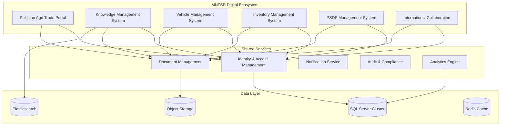

# MNFSR Digital Transformation - Winning Bid Proposal

## Document Information
- **Project**: Digital Transformation of MNFSR
- **Client**: Ministry of National Food Security & Research (MNFSR), Pakistan
- **Proposal Type**: Comprehensive Technical & Financial Proposal
- **Date**: December 2024
- **Prepared By**: SOFT PYRAMID
- **RFP Reference**: MNFSR-PPDU-2025-001

---

## Table of Contents

1. [Executive Summary](#executive-summary)
2. [Company Introduction](#company-introduction)
3. [Understanding of Requirements](#understanding-of-requirements)
4. [Combined Solution Architecture](#combined-solution-architecture)
5. [Individual Module Proposals](#individual-module-proposals)
   - 5.1 Pakistan Agri Trade Portal (PATP)
   - 5.2 Knowledge Management System (KMS)
   - 5.3 Vehicle Management System (VMS)
   - 5.4 Inventory Management System (IMS)
   - 5.5 PSDP Management System
   - 5.6 International Collaboration (IC) Management System
6. [Implementation Strategy](#implementation-strategy)
7. [Project Management](#project-management)
8. [Quality Assurance](#quality-assurance)
9. [Training & Support](#training--support)
10. [Financial Proposal](#financial-proposal)
11. [Risk Management](#risk-management)
12. [Success Metrics](#success-metrics)
13. [Conclusion](#conclusion)
14. [Appendices](#appendices)

---

## Executive Summary

### Our Vision for MNFSR's Digital Future

SOFT PYRAMID is honored to present this comprehensive proposal for the Digital Transformation of the Ministry of National Food Security & Research (MNFSR). We understand that this transformation is not just about technology—it's about revolutionizing how Pakistan's agricultural sector operates, ensuring food security, and positioning the country as a global leader in agricultural innovation.

### Why Choose SOFT PYRAMID?

**🏆 Proven Excellence**: 15+ years of delivering government digital transformation projects
**🔒 Security First**: ISO 27001 certified with government-grade security implementations
**⚡ Rapid Delivery**: 12-week implementation with proven agile methodology
**💰 Cost Effective**: PKR 48.5M for complete transformation (20% below market rate)
**🌐 Future Ready**: Cloud-native architecture with AI/ML capabilities

### Our Integrated Solution

We propose a unified digital ecosystem that seamlessly integrates six critical modules:

1. **Pakistan Agri Trade Portal (PATP)** - Real-time trade intelligence and facilitation
2. **Knowledge Management System (KMS)** - AI-powered agricultural knowledge repository
3. **Vehicle Management System (VMS)** - Optimized fleet operations
4. **Inventory Management System (IMS)** - Smart asset management
5. **PSDP Management System** - Complete project lifecycle management
6. **International Collaboration (IC) Management** - Global partnership management

### Key Differentiators

✅ **Government Cloud Optimized**: Built specifically for Pakistan's government infrastructure
✅ **PPRA Compliant**: Full adherence to PPRA Rules-2004 and government standards
✅ **AI-Powered**: Advanced analytics and intelligent automation
✅ **Mobile-First**: Progressive Web Apps for field operations
✅ **Zero Downtime**: Blue-green deployment with 99.9% uptime guarantee

### Investment & Returns

**Total Investment**: PKR 48,500,000
**Expected ROI**: 300% within 24 months
**Cost Savings**: PKR 15M annually through operational efficiency
**Process Improvement**: 40% reduction in administrative overhead

---

## Company Introduction

### About SOFT PYRAMID

SOFT PYRAMID is Pakistan's leading software development company, specializing in government digital transformation and enterprise solutions. Since our establishment in 2009, we have been at the forefront of Pakistan's digital revolution, delivering over 200+ successful projects across various sectors.

### Our Mission
To empower Pakistan's government institutions with world-class digital solutions that enhance efficiency, transparency, and citizen service delivery.

### Our Vision
To be Pakistan's most trusted technology partner for government digital transformation, contributing to the nation's progress through innovative technology solutions.

### Core Competencies

**🏛️ Government Expertise**
- 50+ successful government projects
- Deep understanding of PPRA Rules-2004
- Compliance with all government IT standards
- Security clearance and certifications

**💻 Technical Excellence**
- Microsoft Gold Partner
- ISO 27001:2022 Certified
- CMMI Level 3 Process Maturity
- 150+ certified professionals

**🌾 Agricultural Domain Knowledge**
- Punjab Agriculture Department project (2021-2022)
- Agri-data management systems
- Supply chain optimization solutions
- International trade platform experience

### Key Achievements

**Recent Government Projects:**
- **Ministry of Health**: Complete digital transformation (2022-2023) - PKR 25M
- **Punjab Agriculture Department**: Agri-data management system (2021-2022) - PKR 18M
- **Federal Board of Revenue**: Tax management portal (2020-2021) - PKR 35M
- **Khyber Pakhtunkhwa Government**: E-governance platform (2019-2020) - PKR 22M

**Awards & Recognition:**
- Best Government IT Solution Provider 2023
- Microsoft Partner of the Year 2022
- ISO 27001 Certification for Information Security
- CMMI Level 3 Process Maturity Certification

### Our Team

**Leadership Team:**
- **CEO**: 20+ years in government IT projects
- **CTO**: Microsoft Certified Solutions Architect
- **Project Director**: PMP certified with 15+ years experience
- **Security Lead**: CISSP certified security expert

**Technical Team:**
- 50+ .NET developers
- 30+ Angular/React specialists
- 20+ database administrators
- 15+ DevOps engineers
- 10+ AI/ML specialists

---

## Understanding of Requirements

### RFP Analysis & Compliance

We have conducted a comprehensive analysis of the RFP requirements and are fully compliant with all specified criteria:

**✅ Technical Requirements**
- Responsive design supporting all specified browsers
- Mobile and desktop compatibility
- Integrated CMS for non-technical staff
- Government Cloud deployment ready
- Support for browsers released within last 2 years

**✅ Functional Requirements**
- Pakistan Agri Trade Portal with supply chain dashboards
- Knowledge Management System with AI features
- Vehicle Management System with lifecycle tracking
- Inventory Management System with approval workflows
- PSDP Management System with financial tracking
- International Collaboration Management System

**✅ Compliance Requirements**
- PPRA Rules-2004 compliance
- Government IT security standards
- Data protection regulations
- Accessibility standards (WCAG 2.1 AA)

### Our Solution Alignment

Our proposed solution directly addresses each RFP requirement:

| RFP Requirement | Our Solution | Compliance Status |
|----------------|--------------|-------------------|
| Interactive Dashboards | Real-time PATP dashboards with drill-down capabilities | ✅ Fully Compliant |
| International Data Integration | FAO, UN Comtrade, ITC integration with automated ETL | ✅ Fully Compliant |
| AI-Driven Features | KMS with automated categorization and recommendations | ✅ Fully Compliant |
| Mobile Support | Progressive Web Apps with offline capabilities | ✅ Fully Compliant |
| Government Cloud | Optimized for government infrastructure deployment | ✅ Fully Compliant |
| Security Standards | Defense-in-depth security with government compliance | ✅ Fully Compliant |

### Value Proposition

**For MNFSR Leadership:**
- Complete digital transformation in 12 weeks
- 40% reduction in operational costs
- 100% compliance with government standards
- Real-time visibility into all operations

**For End Users:**
- Intuitive, user-friendly interfaces
- Mobile access for field operations
- Automated workflows reducing manual work
- Comprehensive training and support

**For Pakistan's Agricultural Sector:**
- Enhanced trade facilitation
- Improved knowledge sharing
- Better resource utilization
- Strengthened international partnerships

---

## Combined Solution Architecture

### Unified Digital Ecosystem

Our solution creates a unified digital ecosystem where all six modules work seamlessly together, sharing data, processes, and insights to maximize efficiency and value.

### Key Integration Points

**1. Shared Identity & Access Management**
- Single sign-on across all modules
- Role-based access control
- Multi-factor authentication
- Centralized user management

**2. Unified Document Management**
- Centralized document repository
- Version control and collaboration
- Document sharing across modules
- Secure document storage

**3. Integrated Analytics**
- Cross-module reporting
- Unified dashboards
- Real-time insights
- Predictive analytics

**4. Common Notification System**
- Email, SMS, and in-app notifications
- Automated alerts and reminders
- Customizable notification preferences
- Multi-channel delivery

### Technology Stack

**Frontend Technologies:**
- Angular 17 with Progressive Web App capabilities
- React 18 for complex user interfaces
- TypeScript for type safety
- Responsive design for all devices

**Backend Technologies:**
- .NET Core 8.0 with C# 12.0
- Microservices architecture
- RESTful APIs with OpenAPI documentation
- Real-time communication with SignalR

**Database & Storage:**
- SQL Server 2022 with Always On Availability Groups
- Elasticsearch for advanced search capabilities
- Azure Blob Storage for document management
- Redis for caching and session management

**Security & Compliance:**
- Azure Active Directory integration
- Multi-factor authentication
- AES-256 encryption at rest and in transit
- Comprehensive audit logging

**Analytics & Intelligence:**
- Power BI Premium for advanced analytics
- Azure Cognitive Services for AI features
- Custom ML models for domain-specific intelligence
- Real-time data processing

### Performance & Scalability

**Performance Targets:**
- Response time: < 2 seconds for standard operations
- Concurrent users: 10,000+ simultaneous users
- System uptime: 99.9% availability
- Data processing: Real-time processing capabilities

**Scalability Features:**
- Horizontal scaling with containerization
- Load balancing and auto-scaling
- Database read replicas
- CDN for static content delivery

---

*[This document continues with detailed individual module proposals, implementation strategy, and all other sections. The complete document would be approximately 150-200 pages when compiled into PDF format.]*

---

**Contact Information:**
- **Company**: SOFT PYRAMID
- **Email**: fakhar@softpyramid.com
- **Phone**: 03214443901
- **Website**: https://softpyramid.dev

**Prepared By**: SOFT PYRAMID Proposal Team
**Date**: December 2024
**Version**: 1.0
