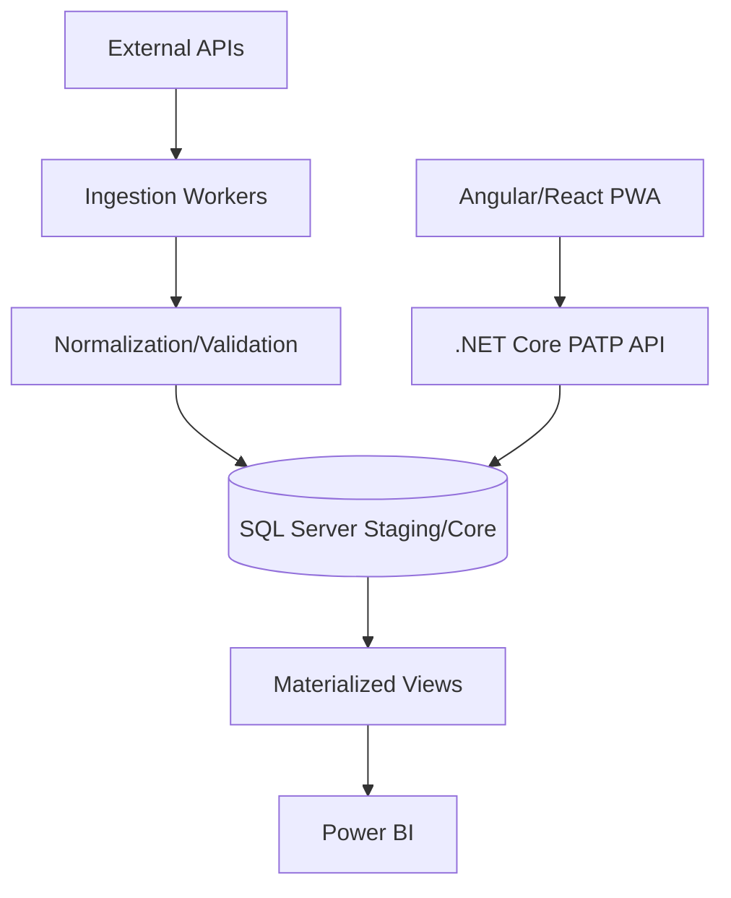
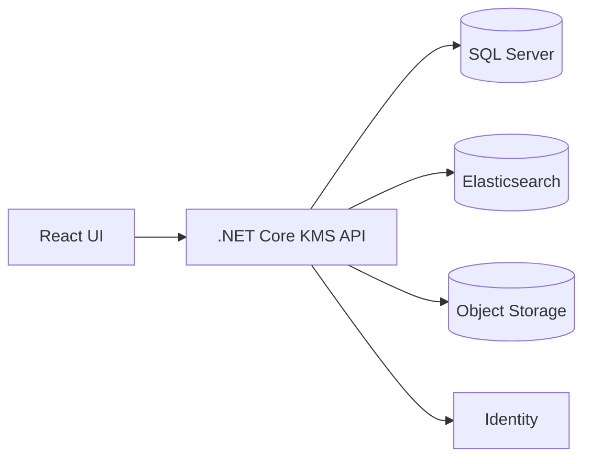
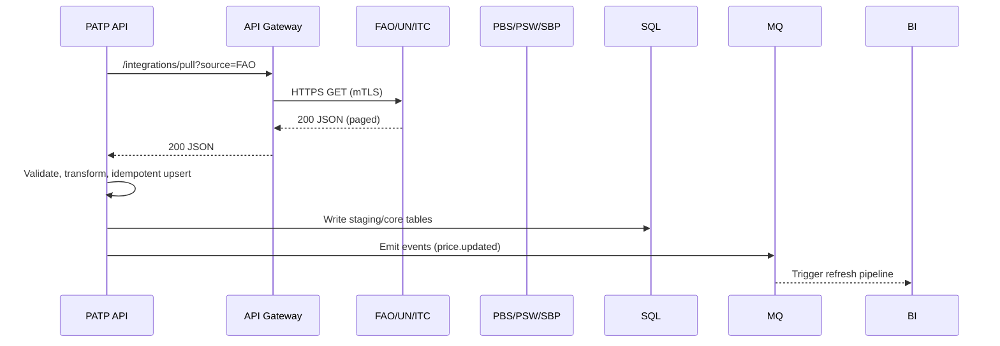
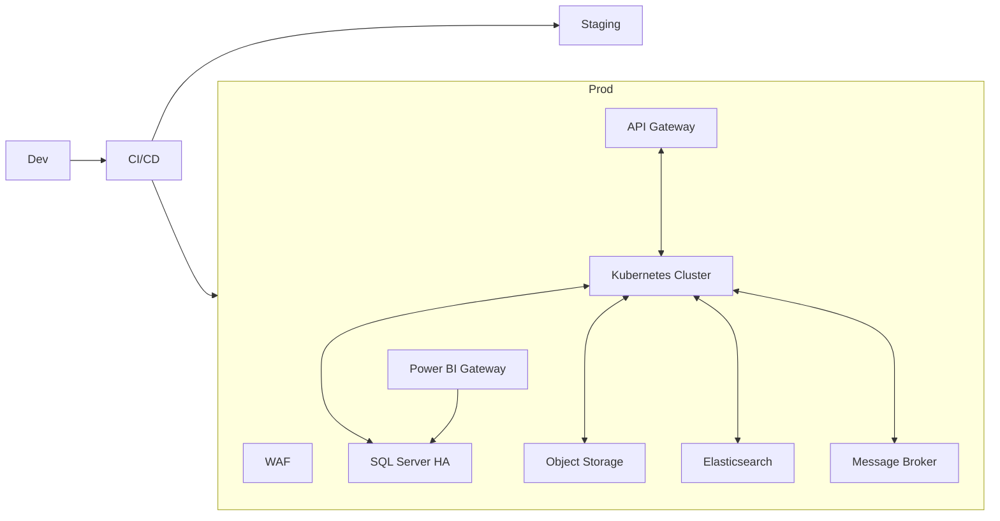

# MNFSR IT System – Technical Architecture Document

## Document Information
- **Project**: Digital Transformation of MNFSR
- **Client**: Ministry of National Food Security & Research (MNFSR), Pakistan
- **Version**: 1.0
- **Date**: September 2025
- **Prepared By**: SOFT PYRAMID

---

## 1. Executive Summary
This document defines the end-to-end technical architecture for the MNFSR IT System spanning six integrated modules: Pakistan Agri Trade Portal (PATP), Knowledge Management System (KMS), Vehicle Management System (VMS), Inventory Management System (IMS), PSDP Management System, and International Collaboration (IC) Management System. The architecture follows a modular, API-first, secure-by-design approach using .NET Core, Angular/React, SQL Server, and Power BI, deployed on Government Cloud infrastructure.

---

## 2. High-Level System Architecture

### 2.1 Architecture Diagram
```mermaid
flowchart LR
  subgraph Clients
    U[Web Users\n(Internal & External)]
    M[Mobile/PWA Users]
    BIU[BI Consumers]
  end

  U --> WAF[Web Application Firewall]
  M --> WAF
  BIU --> BI(Power BI Service/Gateway)

  WAF --> AGW[API Gateway / Ingress]

  subgraph App Layer [.NET Core Services]
    PATP[Service: PATP]
    KMS[Service: KMS]
    VMS[Service: VMS]
    IMS[Service: IMS]
    PSDP[Service: PSDP]
    IC[Service: IC]
    AUTH[Identity & Access (MFA, RBAC)]
    NOTIF[Notification Service]
    DOCS[Document Service]
    SEARCH[Search Service]
    AUDIT[Audit & Logging]
  end

  AGW --> PATP
  AGW --> KMS
  AGW --> VMS
  AGW --> IMS
  AGW --> PSDP
  AGW --> IC
  AGW --> AUTH

  PATP --> NOTIF
  KMS --> DOCS
  KMS --> SEARCH
  VMS --> DOCS
  IMS --> DOCS
  PSDP --> DOCS
  IC --> DOCS
  PATP --> AUDIT
  KMS --> AUDIT
  VMS --> AUDIT
  IMS --> AUDIT
  PSDP --> AUDIT
  IC --> AUDIT

  subgraph Data Layer
    SQL[(SQL Server Cluster)]
    ES[(Elasticsearch for KMS Search)]
    FS[(Object Storage for Files)]
    MQ[(Message Broker)]
  end

  PATP <--> SQL
  KMS <--> SQL
  VMS <--> SQL
  IMS <--> SQL
  PSDP <--> SQL
  IC <--> SQL
  KMS <--> ES
  DOCS <--> FS
  ALL[[All Services]] --> MQ

  subgraph External Data Sources
    FAO[FAO / FAOSTAT]
    UN[UN Comtrade]
    ITC[ITC/Trademap]
    PBS[PBS]
    PSW[PSW]
    SBP[SBP]
    PROV[Provincial Portals]
  end

  FAO --> PATP
  UN --> PATP
  ITC --> PATP
  PBS --> PATP
  PSW --> PATP
  SBP --> PATP
  PROV --> PATP

  BI --> SQL
```

### 2.2 Design Principles
- API-first, modular microservices
- Defense-in-depth security, zero-trust networking
- 12-week delivery with shared reusable services
- Observability by default (metrics, logs, traces)
- Cloud portability with containerization

---

## 3. Module Technical Architectures

### 3.1 Pakistan Agri Trade Portal (PATP)
- Frontend: Angular/React PWA; role-based dashboards; multilingual (EN/UR)
- Backend: .NET Core service (ingest, analytics, trade facilitation, grievance)
- Integrations: FAO/UN Comtrade/ITC (pull), PBS/PSW/SBP/provincial portals
- Storage: SQL Server (commodity, price, market), Object Storage (docs)
- Analytics: Power BI semantic model; pre-aggregations via SQL views
- Messaging: Ingestion pipelines via MQ; retry & idempotency



### 3.2 Knowledge Management System (KMS)
- Frontend: React with rich file operations; WCAG 2.1 AA
- Backend: .NET Core; document metadata, access control, collaboration
- Search: Elasticsearch; AI tagging via Cognitive Services (optional)
- Storage: Object storage (files), SQL Server (metadata, ACLs)



### 3.3 Vehicle Management System (VMS)
- Backend: .NET Core; CRUD, scheduling, maintenance
- Data: SQL Server (vehicle, maintenance, fuel, mileage)
- Integrations: Finance (cost centers), HR (drivers)

### 3.4 Inventory Management System (IMS)
- Backend: .NET Core; requisitions, approvals, stock movements, audit
- Data: SQL Server (assets, inventory, transactions)
- Integrations: Finance, Procurement

### 3.5 PSDP Management System
- Backend: .NET Core; PC forms, budgets, progress, disbursements
- Data: SQL Server; document repository via Object Storage

### 3.6 International Collaboration (IC) Management
- Backend: .NET Core; agreements, workflows, renewals, notifications
- Data: SQL Server; documents in Object Storage

---

## 4. Technology Stack Justification
- .NET Core/C#: enterprise-grade, security, performance, large ecosystem
- Angular/React: robust SPA/PWA frameworks, long-term support
- SQL Server: ACID transactions, mature tooling, Power BI synergy
- Power BI: rapid analytics for government reporting; row-level security
- Elasticsearch (KMS): sub-second search across large document sets
- Message Broker: decouple ingestion and processing; reliability

---

## 5. Integration Architecture

- Security: mTLS to external sources where supported; API keys/secrets in vault
- Fault tolerance: circuit breakers, exponential backoff, dead-letter queues

---

## 6. Security Architecture
- Identity: Central IAM (.NET + OpenID Connect), MFA, RBAC, ABAC where needed
- Transport: TLS 1.3 end-to-end; HSTS; secure cookies
- Data at rest: AES-256 for DB and object storage
- Secrets: Managed key vault, periodic rotation
- App security: OWASP ASVS controls, input validation, CSRF/XSS mitigation
- Logging/Audit: Immutable audit trails; SIEM integration; log redaction
- Network: WAF, private subnets, NSGs, bastion access, zero-trust between services (mTLS)

---

## 7. Scalability & Performance
- Horizontal scaling of stateless services (containers)
- Caching: Redis for hot data; HTTP caching for static assets
- DB performance: read replicas, partitioning where needed, indexed views
- Async processing: MQ-based workers for heavy tasks
- BI: Incremental refresh, star schema models

---

## 8. Deployment Architecture

- Strategy: Rolling/blue-green releases; database migrations via CI gates
- Environments: Dev, Staging (UAT), Production; isolated VNETs
- DR: Daily full + hourly diff backups; RPO ≤ 1 hour; RTO ≤ 4 hours

---

## 9. API Architecture & Microservices Design
- Service boundaries align to modules; shared services for identity, docs, notifications, audit
- API Gateway: routing, auth, throttling, request/response normalization
- Versioning: URI-based (v1, v2), deprecation policy 12 months
- Contracts: OpenAPI 3.1; schema-first; contract tests
- Events: price.updated, document.tagged, vehicle.maintained, stock.moved, project.updated, agreement.renewed

---

## 10. Observability
- Metrics: Prometheus-compatible; SLOs with error budgets
- Tracing: OpenTelemetry; trace IDs propagated via gateway
- Logs: Centralized, structured JSON; retention with ILM policies

---

## 11. Cross-Cutting Concerns
- Internationalization (EN/UR)
- Accessibility (WCAG 2.1 AA)
- CMS-backed content for PATP
- Data catalog and lineage for ingested datasets

---

## 12. References
- `docs/MNFSR_IT_System_Master_Index_Updated.md`
- Module documents: `docs/Module_01_*` to `docs/Module_06_*`
- RFP: `docs/Planning_and_Development_7sep_Extracted_Text.txt`
