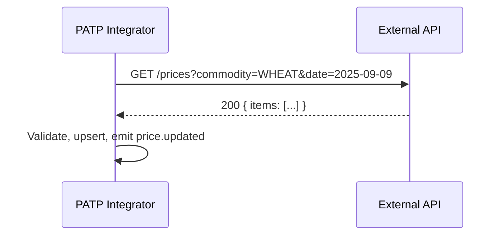

# MNFSR IT System – API Integration Specifications

## Document Information
- **Project**: Digital Transformation of MNFSR
- **Client**: Ministry of National Food Security & Research (MNFSR), Pakistan
- **Version**: 1.0
- **Date**: September 2025
- **Prepared By**: SOFT PYRAMID

---

## 1. Executive Summary
Defines standards and specifications for integrating external data sources (FAO, UN Comtrade, ITC, PBS, PSW, SBP, provincial portals) and internal module-to-module APIs. Covers authentication, authorization, versioning, error handling, rate limiting, documentation, testing, and data synchronization.

---

## 2. External API Integrations
- FAO/FAOSTAT, UN Comtrade, ITC/Trademap: REST/JSON, API keys; pagination; retries with backoff; mTLS where supported
- PBS, PSW, SBP, Provincial Portals: REST/SOAP as provided; secure channel via VPN/IP whitelisting; SOW and MoUs for access
- Schedules: nightly full pulls; intra-day deltas for critical datasets (prices)
- Idempotency: upstream request-id; deduplicate by composite keys (source, commodity, date)



---

## 3. Internal API Specifications
- Style: RESTful JSON over HTTPS; gRPC optional for internal service-to-service
- Standards: OpenAPI 3.1 for all REST endpoints; JSON:API-inspired conventions
- Resource naming: kebab-case for paths; plural resources
- Pagination: cursor-based preferred; limit default 50, max 500

### 3.1 Common
- Headers: Authorization: Bearer <jwt>; X-Request-Id; Accept-Language (en, ur)
- AuthZ: RBAC claims in JWT; fine-grained checks at service
- Errors: RFC 7807 problem+json
- Dates: ISO 8601 UTC

### 3.2 Example Endpoints

PATP
```
GET /api/v1/commodities
GET /api/v1/commodities/{id}
GET /api/v1/market-prices?commodityId=&from=&to=&source=
POST /api/v1/grievances
```

KMS
```
POST /api/v1/documents
GET  /api/v1/documents/{id}
POST /api/v1/documents/{id}/versions
GET  /api/v1/search?q=&tags=
```

VMS
```
POST /api/v1/vehicles
POST /api/v1/vehicles/{id}/maintenance
GET  /api/v1/vehicles/{id}/fuel-logs?from=&to=
```

IMS
```
POST /api/v1/requisitions
POST /api/v1/requisitions/{id}/approve
POST /api/v1/issues
POST /api/v1/returns
```

PSDP
```
POST /api/v1/projects
POST /api/v1/projects/{id}/milestones
GET  /api/v1/projects/{id}/expenditures?fy=
```

IC
```
POST /api/v1/agreements
POST /api/v1/agreements/{id}/renewals
GET  /api/v1/agreements?country=&type=&status=
```

### 3.3 Sample OpenAPI Snippet
```yaml
openapi: 3.1.0
info:
  title: PATP API
  version: 1.0.0
paths:
  /api/v1/market-prices:
    get:
      summary: List market prices
      parameters:
        - in: query
          name: commodityId
          schema: { type: integer }
        - in: query
          name: from
          schema: { type: string, format: date }
        - in: query
          name: to
          schema: { type: string, format: date }
      responses:
        '200':
          description: OK
          content:
            application/json:
              schema:
                type: object
                properties:
                  items:
                    type: array
                    items:
                      $ref: '#/components/schemas/MarketPrice'
components:
  schemas:
    MarketPrice:
      type: object
      properties:
        id: { type: integer }
        commodityId: { type: integer }
        priceDate: { type: string, format: date }
        priceUsd: { type: number, format: float }
        source: { type: string }
```

---

## 4. Authentication & Authorization
- Authentication: OpenID Connect/OAuth2; JWT access tokens (short TTL); refresh via gateway
- MFA: enforced for privileged actions; step-up auth for sensitive endpoints
- Service-to-service: mTLS + client credentials; audience-restricted JWTs
- RBAC: roles (admin, manager, analyst, user); claims-based resource checks

---

## 5. Versioning Strategy
- URI versioning (v1); breaking changes released as v2
- Sunset headers for deprecations; 12-month deprecation window

---

## 6. Error Handling & Response Formats
- Problem Details (RFC 7807): type, title, status, detail, instance
- Error codes: business-domain catalog per module
- Correlation: echo X-Request-Id; include traceId when available

---

## 7. Rate Limiting & Throttling
- Per-client quotas on gateway; sliding window limits
- Retry-After headers; exponential backoff guidance

---

## 8. API Documentation Standards
- OpenAPI sources in repo; generated HTML via Swagger UI/Redoc
- Example payloads and schemas; JSON Schema for validation; contract tests in CI

---

## 9. Integration Testing Specifications
- Contract tests: Pact or similar for consumer/provider
- E2E tests: Postman collections/GitHub Actions; k6 for performance
- Mocking: WireMock for external APIs; service mesh fault injection for resilience

---

## 10. Data Synchronization Protocols
- Pull-based scheduled ETL for external sources; delta capture where supported
- Event-driven internal sync via MQ (at-least-once); idempotent consumers
- Data freshness SLAs: daily for static datasets, hourly for price feeds

---

## 11. Security Controls for Integrations
- Secrets in key vault; IP allowlists; signed requests where applicable
- Validation: schema validation on ingress; antivirus scanning for file uploads

---

## 12. References
- RFP: `docs/Planning_and_Development_7sep_Extracted_Text.txt`
- Module docs: `docs/Module_01_*` to `docs/Module_06_*`